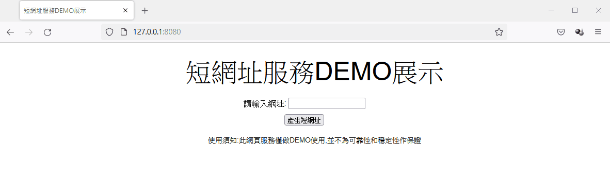
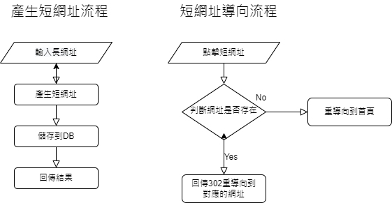

# 短網址服務
簡單利用SpringBoot 去實作短網址服務,主要使用'H2' DB存儲長短網址之間映射關係,短網址產生方式使用timestamp 轉成 62進位作為ID值

## 畫面展示


## 流程說明


## 執行方式

編譯打包完成後執行,jar檔名稱依照打包結果自行替換

```shell
java -jar shortlink-0.0.1.jar
```

打開瀏覽器輸入

```shell
http://127.0.0.1:8080/
```


## 參考文章
* [短链接、短网址使用的是什么算法？](https://www.zhihu.com/question/20103344/answer/573638467)
* [HTTP状态码301和302的区别详解](https://blog.csdn.net/qq_43968080/article/details/107355758)
* [9种分布式ID生成方式](https://zhuanlan.zhihu.com/p/107939861)